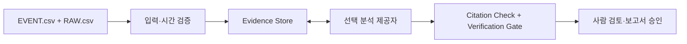

# TripLens

**산업 운영 데이터를 근거로 검토하고, 결과를 추적 가능한 보고서 초안으로 정리하는 읽기 전용 분석 도구입니다.**

[웹 앱](https://triplens-web-preview-cmxrp0x82-junsic-s-projects.vercel.app) · [GitHub 저장소](https://github.com/khaku25/triplens-thermosyspro-cloud-runner) · [개발 이력](docs/DEVELOPMENT_LOG.md) · [워크플로 계약](docs/TRIPLENS_WORKFLOW_BOUNDARY.md)

> EVENT/RAW 원본을 보존하면서 필요한 근거만 조회합니다. 자동 검증과 사람의 최종 승인은 서로 다른 단계입니다.

## 1. 목적과 범위

TripLens는 이벤트 및 공정 데이터와 등록된 Tag/Logic 참조를 함께 검토해 핵심 사건, 원인 후보, 근거와 반대 근거를 보여줍니다. 검토자는 인용된 원본을 확인하고 구조화된 보고서 초안을 편집할 수 있습니다.

## 2. 분석 흐름



Python Agent API가 입력 검증, 근거 조회, Tool 실행 및 Citation/Gate 검사를 수행합니다. 선택된 AI 제공자는 조회된 근거를 해석해 구조화된 결과를 작성합니다.

## 3. 핵심 기능

- **Evidence Explorer** — 인용된 EVENT/RAW 행으로 이동해 분석 근거를 확인합니다.
- **Tag / Logic Master** — 등록된 ID와 관계를 정확한 참조 기준으로 탐색합니다.
- **Drawing / Process View** — 근거와 연결된 도면 및 공정 문맥을 살펴봅니다.
- **Incident Report** — 같은 분석의 근거와 연결된 편집 가능한 8열×10섹션 보고서 초안을 제공합니다.
- **Engineering Reviewer** — 선택적으로 별도 검토를 실행하고 보고서 Snapshot을 확인합니다.

## 4. 결과 상태와 승인 경계

| 구분 | 상태 | 의미 |
|---|---|---|
| Claim | `OBSERVED` / `CANDIDATE` / `UNKNOWN` | 관측 사실, 후보 주장, 불확실성 구분 |
| Verification Gate | `PASS` / `HOLD` | 근거·시간·출력 형식 검증 결과 |
| Human Review | 별도 검토 | 결론과 보고서의 최종 공학 승인 |

`PASS`는 설정된 Gate 검사를 통과했다는 뜻이지 원인 확정이나 사람의 승인을 뜻하지 않습니다. AI 신뢰도, 등록 Logic 또는 자동 검증 결과만으로 공학적 결론을 확정하지 않습니다.

## 5. 현재 검증 요약

2026-09-27 기준 시스템 명세에 기록된 서로 다른 검증 결과입니다.

| 항목 | 결과 | 확인 범위 |
|---|---:|---|
| 웹 분석 실행 묶음 | 12/12 실행 PASS | 업로드→분석→근거→보고서 기록 흐름; 정확도 점수 아님 |
| Preview Tag 색인 | 606/606 검색 가능 | 정적 색인 ID 무결성 |
| Preview Logic 색인 | 55/55 검색 가능 | 등록 ID 조회 |
| Report QA | 12개 산출물, 48/48 페이지 | 보고서 산출물 검사; 결론 승인 아님 |

CSV/PINPOINT 동작, 전체 모바일 사용, 세션 초기화는 `PARTIAL` 또는 `NOT TESTED`로 기록되어 있습니다. 서로 다른 기준선은 하나의 통과율로 합산하지 않습니다. 현장 정확도와 시설별 공학적 타당성은 별도 평가가 필요합니다.

## 6. 입력·근거 계약

<details>
<summary>파일 조건과 Evidence Tool 제한 보기</summary>

- 입력은 동일 분석에 연결된 `EVENT.csv`와 `RAW.csv`입니다.
- 직접 업로드는 두 파일 합계 4,000,000 bytes 이하입니다.
- `model_time_s`는 인과 순서와 분석 구간에 사용하고, `wall_time_utc`는 감사·전송 시각으로 구분합니다.
- 정답성 Metadata는 분석 입력에서 제외합니다. 원본 EVENT/RAW 관측값은 변경하지 않습니다.
- 전체 RAW를 초기 Prompt에 전달하지 않습니다. 등록 Tag/Logic은 exact match로만 조회하며 미등록 ID를 추정하지 않습니다.
- 분석당 Evidence Tool 호출 예산은 합계 최대 8회입니다.

| Tool | 기능 | 상한 |
|---|---|---|
| `search_events` | 사건 검색 | 20 EVENT |
| `get_event_window` | 전후 사건 순서 | 30 EVENT · ±10초 |
| `get_raw_window` | 여러 Tag의 구간 비교 | 8 Tag · 50 Row · 20초 |
| `get_tag_series` | 단일 Tag 추세 | 50 Point |
| `get_logic_context` | 등록 Logic/upstream 조회 | 12 Logic Row |
| `get_equipment_state` | 주변 사건과 RAW 상태 | 10 EVENT · 8 RAW Tag |

</details>

## 7. 기술 구성

| 구성 | 현재 기준 |
|---|---|
| Web Frontend | Next.js 16.3.5 · React 19.2.0 |
| Agent API | Python 3.12+ · FastAPI |
| 분석 제공자 | 기본 Gemini · 선택형 OpenAI |
| 배포 | Vercel · `main` 기준 |

모델과 제공자 설정은 변경될 수 있습니다. API 키는 서버 환경에서만 사용하며 브라우저에 전달하지 않습니다. 키가 설정되어 있다는 사실만으로 키 유효성이나 실제 모델 응답이 확인되는 것은 아닙니다.

## 8. 로컬 실행

```bash
git clone https://github.com/khaku25/triplens-thermosyspro-cloud-runner.git
cd triplens-thermosyspro-cloud-runner/apps/web
npm install
npm run dev
```

웹 프런트엔드는 `http://localhost:3000`에서 실행됩니다. 전체 분석에는 별도의 Agent API 및 서버 측 제공자 설정이 필요합니다. 비밀키를 프런트엔드 코드에 넣거나 저장소에 커밋하지 마세요.

## 9. 저장소 구성

<details>
<summary>주요 폴더 보기</summary>

| 경로 | 내용 |
|---|---|
| `apps/web/` | TripLens 웹 애플리케이션 |
| `services/agent-api/` | Agent API와 Provider Adapter |
| `config/`, `data/`, `logic_db/`, `logic_diagrams/` | 데이터 계약과 등록 참조 자산 |
| `scripts/`, `tests/` | 변환·검증·회귀 확인 코드 |
| `matlab/`, `modelica/`, `examples/` | 공학 참고 구현과 지원 자산 |
| `docs/` | 워크플로 계약, 설계 참고자료, 검증 기록 |

지원 자산이 저장소에 있다는 사실만으로 모든 자산이 배포 앱에서 활성화되거나 모든 시설·운전 조건에 대해 검증되었다는 뜻은 아닙니다.

</details>

## 10. 개발 이력과 기준 문서

9월 7일부터 데이터·실행 기반, TripLens 웹/API, 근거 탐색과 보고서 검토 흐름까지 정리한 [개발일지](docs/DEVELOPMENT_LOG.md)를 참고하세요. 전체 이력은 [GitHub 커밋 목록](https://github.com/khaku25/triplens-thermosyspro-cloud-runner/commits/main/)에서 확인할 수 있습니다.

- [TripLens 데이터 및 책임 경계](docs/TRIPLENS_WORKFLOW_BOUNDARY.md)
- [간결한 보고서 작성 정책](docs/CONCISE_REPORT_POLICY.md)
- [통합 Testbench 및 보고서 흐름](docs/INTEGRATION_TESTBENCH_REPORT_V2.md)
- [저장소 구성 안내](docs/repository-map.md)

## 11. 제한

TripLens는 분석·보고 지원 도구입니다. 검토자의 공학적 판단과 승인 없이 분석 결과를 운전 지시, 보호 설정, 복구 또는 재기동 결정으로 사용하지 않습니다.

