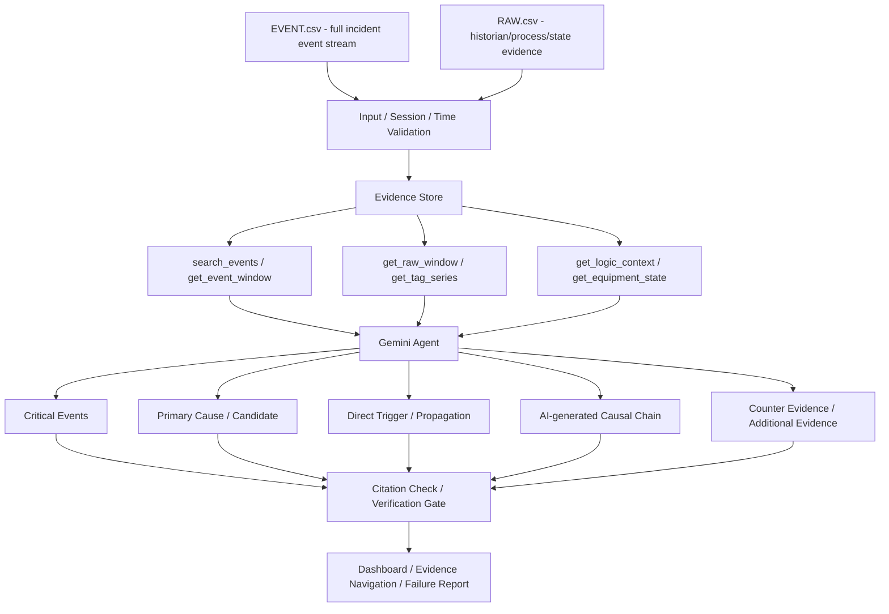
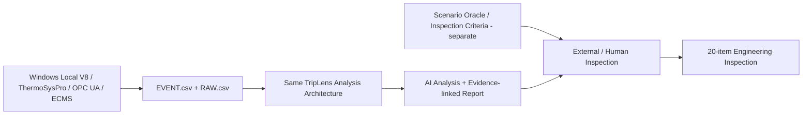

# TripLens System Architecture
## KIEE 2026 Agentic AI 제출용 · Current Validation Baseline

## 1. 출품작 본체



## 2. 역할 분리

| 계층 | 역할 |
|---|---|
| Input Layer | EVENT/RAW 파일의 세션·사고·시간·형식 검증 |
| Evidence Store | 전체 Event Stream과 RAW 시계열을 원본 참조 가능한 상태로 저장·정렬 |
| Tool Layer | 필요한 Event, 시간창, Tag trend, Logic, 설비상태를 제한적으로 조회 |
| Gemini Agent | Critical Event 선정, 원인 후보, Direct Trigger, Propagation, Causal Chain, 반대 근거 판단 |
| Verification Layer | 실제 조회된 Evidence ID, Tag, 형식, 시간관계가 주장과 연결되는지 검사 |
| Human | 최종 공학적 원인 확정, 보고서 승인, 운전·복구 판단 |

Python/Engineering Layer가 최종 Primary Cause나 Causal Chain을 미리 결정하지 않는다.

## 3. 실제 Evidence Tools

현재 분석구조는 다음 6종의 Evidence Tool을 사용한다.

- `search_events()`
- `get_event_window()`
- `get_raw_window()`
- `get_tag_series()`
- `get_logic_context()`
- `get_equipment_state()`

분석당 Tool Call 합계는 제한되며, 모든 도구를 고정 순서로 한 번씩 호출하는 구조가 아니다.

## 4. EVENT와 RAW

### EVENT.csv

- Alarm / Return
- Protection Event
- Breaker / Equipment State Change
- Operator Action
- System Event

EVENT는 사람이 정답에 맞춰 사전에 몇 줄로 잘라주는 입력이 아니라 사고 중 기록된 Event Stream이다.

### RAW.csv

- Pressure / Temperature / Flow / Level
- Speed / Power
- Command / Request
- Latch / Logic state
- Breaker / Motor / Valve state
- Quality / model time

EVENT와 RAW는 동일 사고의 서로 다른 Evidence Source이며, Agent는 필요한 근거를 Tool로 조회한다.

## 5. Evidence Policy

Agent Evidence로 허용:
- 실제 관측 Process measurement
- Alarm / Event
- Protection condition
- Trip request / latch
- Breaker / Equipment state
- Operator action
- Runtime logic state

Agent 판단에서 차단:
- Scenario ID / Name
- Expected Cause
- Ground Truth / Answer Label
- 시뮬레이터 시험자만 아는 Fault Injection 내부 metadata

실제 운전환경에서 관측 가능한 Protection/Logic 상태는 이름에 `Cause`가 포함된다는 이유만으로 자동 차단하지 않는다.

## 6. 시간·인과 경계

- 인과 정렬은 `model_time_s` 사용
- `wall_time_utc`는 감사·전송 시각
- 표본 사이 디지털 변화는 정확한 단일 시각으로 조작하지 않고 관측구간으로 유지
- 동시 GT/ST Latch를 근거 없이 GT→ST intertrip으로 단정하지 않음
- Logic 등록 확인과 실제 사고의 공학적 인과 확정을 구분

## 7. Output

- All Events
- Incident Summary
- Critical Events
- Primary Cause / Candidate
- Direct Trigger
- Propagation
- Causal Chain
- Counter Evidence
- Additional Evidence Required
- Affected Equipment
- Operator Check / Recovery Check
- Evidence IDs
- Failure Report

분석 화면에서는 Evidence → Tag → Logic → Drawing/Equipment로 추적하고 다시 분석화면으로 복귀할 수 있도록 연결한다.

## 8. Verification / Fail-Closed

Verification은 Causal Chain을 대신 생성하지 않는다.

검사 대상:
- Evidence ID 실제 존재 여부
- Claim-local Tag 연결
- 구조화 출력 형식
- 시간관계 모순
- 금지 정답 Metadata 사용 여부

근거가 부족하면 `UNKNOWN / HOLD / REVIEW_REQUIRED`를 유지한다.

## 9. 현재 반복 검증

동일 V8 합성환경에서 다음 12개 distinct scenarios의 사이트 실분석 결과가 존재한다.

```text
Direct GT / Direct ST / GT Breaker
IP BFP / HP BFP / LP BFP
HP Drum LL / IP Drum LL / LP Drum LL
HP Drum HH / IP Drum HH / LP Drum HH
```

- 시나리오별 A01~A20, 동일 20개 Engineering Inspection
- 재검증 포함 누적 분석 실행 21회(프로젝트 실행기록 기준)
- 12개 시나리오의 사이트 실분석 최종 고장상보 생성
- HP BFP RAW 결측 사례에서 일부 인과관계를 확정하지 않고 후보/미검증 상태 유지

이 결과는 **Synthetic Environment 내 반복 검증**이며 실제 발전소 Field Validation 또는 전 제조사 실설비 호환성 검증이 아니다.

## 10. 검증환경과의 경계



Virtual Plant와 보호/알람 Runtime은 사고입력을 생성하는 Test Harness다. 세부 구현은 `APPENDIX/09_VIRTUAL_PLANT_TEST_ENVIRONMENT.md`에서 다룬다.
