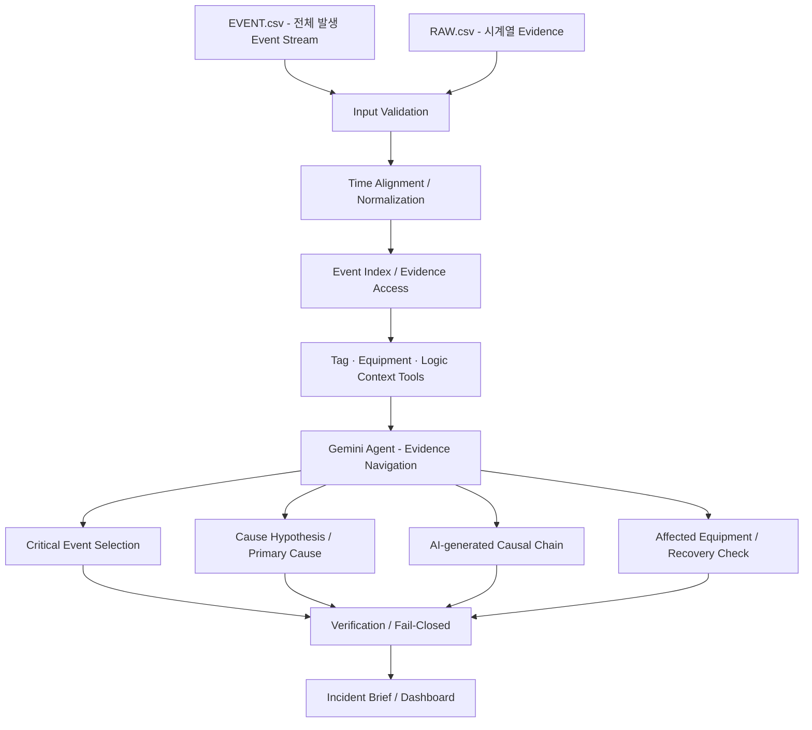
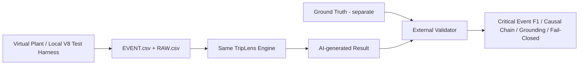

# TripLens System Architecture
## KIEE 2026 Agentic AI 제출용

## 1. 출품작 본체



## 2. 핵심 계층과 역할

| 계층 | 역할 |
|---|---|
| Input Layer | 발생한 EVENT 전체와 RAW 시계열을 수용 |
| Engineering Layer | 입력검증, 시간정렬, Source/Tag 정규화, Event/RAW 인덱싱 |
| Context / Tool Layer | Tag 의미, 설비관계, Protection/Logic 관계, 구간별 RAW/Event 조회 제공 |
| Agent Layer | Gemini가 필요한 Evidence를 탐색하여 핵심 Event, 원인 후보, 인과 Chain을 생성 |
| Verification Layer | AI의 주장과 Causal Edge가 실제 Evidence에 의해 지지되는지 확인하고 Fail-Closed 적용 |
| Output Layer | All Events와 AI가 선별한 Critical Events, Causal Timeline, Evidence, Recovery Check를 함께 제공 |

## 3. EVENT와 RAW의 역할

- `EVENT.csv`: 사고 중 실제 발생한 Alarm, Protection Event, 상태변화, Operator Action 등의 전체 Event Stream
- `RAW.csv`: Event 전후를 교차검증하는 수치·상태·Command·Logic·Historian Evidence

TripLens는 EVENT를 제출 전에 사람이 정답에 맞게 잘라내는 것을 목표로 하지 않는다. 발생한 Event Stream을 입력으로 유지하고, **어떤 Event가 사고 원인과 파급을 설명하는 데 중요한지는 Agent가 Evidence를 조회해 판단**한다.

따라서 Dashboard는 두 층을 구분한다.

```text
ALL EVENTS
- 사고 중 발생한 전체 Event Stream

TRIPLENS ANALYSIS
- Critical Events selected by Agent
- Cause / Cause Candidate
- AI-generated Causal Chain
- Key Evidence
- Affected Equipment
- Recovery Check
```

## 4. Agentic AI 역할

Gemini Agent는 단순히 EVENT 전체를 한 번에 요약하는 역할이 아니다. TripLens가 제공하는 Evidence 조회 수단을 사용해 필요한 근거를 단계적으로 탐색하고 이번 사고의 구조를 생성한다.

Agent의 주요 판단 대상:

- 수많은 Event 중 Critical Event 선정
- Origin / Direct Trigger / Propagation 구분
- 원인 후보 비교 및 Primary Cause 판단
- Event와 RAW 상태변화의 교차확인
- **Causal Chain 생성**
- 상충·누락된 근거 탐지
- 추가 확인 Tag/Event 및 Recovery Check 제시

중요하게, Logic Master나 Engineering Layer는 이번 사고의 Causal Chain 정답을 미리 만들어 Agent에게 제공하지 않는다.

- Logic/Tag Master: "이 Tag와 설비가 무엇을 의미하고 어떤 관계를 가질 수 있는가" 제공
- EVENT/RAW: "이번 사고에서 실제로 무엇이 언제 발생했는가" 제공
- Gemini Agent: "이번 사고의 실제 인과 흐름은 무엇인가" 판단

## 5. Verification의 역할

Verification Layer는 Causal Chain을 대신 생성하지 않는다. Agent가 생성한 결과를 검증한다.

예를 들어 AI가 다음 Edge를 생성했다면:

```text
LP Drum LL Condition
      ↓
GT/ST Trip Request
      ↓
Breaker Open
```

Verification은 각 Edge에 대해 실제 EVENT/RAW/Logic Evidence가 존재하는지를 확인한다.

근거가 충분하지 않으면 다음 상태를 허용한다.

- `UNKNOWN`
- `INCONCLUSIVE`
- `REVIEW REQUIRED`
- `ADDITIONAL EVIDENCE REQUIRED`

## 6. AI Evidence 경계

Blind Validation에서도 실제 운전환경에서 관측 가능한 정보는 Agent Evidence로 사용할 수 있다.

허용 대상 예:
- Process measurement
- Alarm / Event
- Protection condition
- Trip request / latch
- Breaker / equipment state
- Operator action
- Runtime logic state

반대로 시뮬레이션 시험자가 알고 있는 정답 또는 고장주입 내부정보는 Agent 판단근거로 사용하지 않는다.

차단 대상 예:
- Scenario ID
- Expected Cause / Ground Truth
- Fault Injector internal variable
- Simulation-only fault injection command / metadata

현재 제출 전에는 이 Evidence Policy가 실제 Runtime에서 어떻게 강제되는지 최종 RC 기준으로 확인해 기술한다.

## 7. 안전 경계

- READ-ONLY
- OT Write 없음
- 자동복전 없음
- Breaker 자동조작 없음
- Ground Truth 분석 입력 미제공
- 근거 부족 시 확정판정 강제하지 않음

## 8. 검증환경과의 경계



Virtual Plant, OPC UA, ECMS, Protection Matrix, Alarm Rule 수 등은 **TripLens 자체가 아니라 재현 가능한 사고입력을 생성하는 Test Harness**다. 세부사항은 `APPENDIX/09_VIRTUAL_PLANT_TEST_ENVIRONMENT.md`에서 다룬다.
