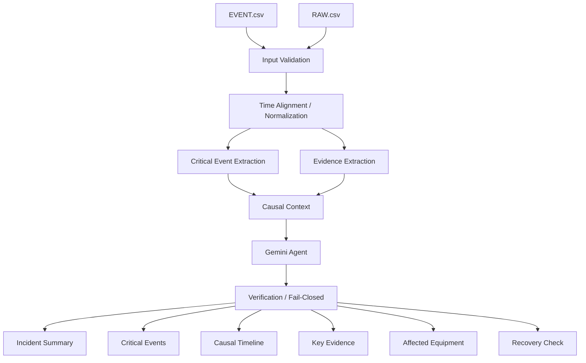
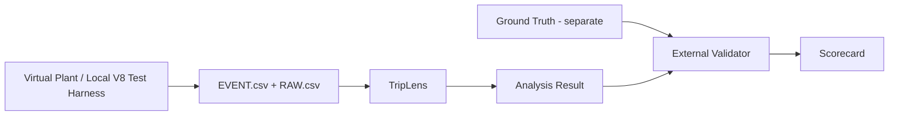

# TripLens System Architecture
## KIEE 2026 Agentic AI 제출용

## 1. 출품작 본체

## 2. 핵심 계층

| 계층 | 역할 |
|---|---|
| Input Layer | EVENT/RAW 파일과 Source/Tag/품질정보 수용 |
| Engineering Layer | 입력검증, 시간정렬, 핵심 Event 및 Evidence 추출 |
| Context Layer | 설비·상태·보호·시계열 관계 구성 |
| Agent Layer | Gemini가 Evidence를 검토하고 사고흐름과 확인사항을 설명 |
| Verification Layer | 근거 누락·상충·과도한 확정판정 확인 |
| Output Layer | Summary, Timeline, Evidence, Recovery Check 제공 |

## 3. 데이터 역할

- `EVENT.csv`: 사고흐름에서 의미 있는 Alarm, Protection Event, 상태변화, Operator Action
- `RAW.csv`: Event를 교차검증하는 수치·상태·Command·Logic·Historian Evidence

TripLens의 목적은 EVENT를 단순 요약하는 것이 아니라 두 입력을 함께 사용해 **사고 초기 정보의 우선순위와 근거를 재구성**하는 것이다.

## 4. Agentic AI 역할

Gemini Agent는 다음을 수행한다.

- 핵심 사건과 사고 진행순서 설명
- 원인 후보 / 직접 계기 / 후속 파급 구분
- Evidence 연결
- 상충·누락된 근거 표시
- 추가 확인항목과 Recovery Check 구성

Gemini는 RAW/EVENT 원본, Ground Truth, Protection Logic을 수정할 수 없다.

## 5. 안전 경계

- READ-ONLY
- OT Write 없음
- 자동복전 없음
- Breaker 자동조작 없음
- Ground Truth 분석 입력 미제공
- 근거 부족 시 UNKNOWN / INCONCLUSIVE / REVIEW REQUIRED 허용

## 6. 검증환경과의 경계

Virtual Plant, OPC UA, ECMS, Protection Matrix, Alarm Rule 수 등은 **TripLens 자체가 아니라 재현 가능한 사고입력을 생성하는 Test Harness**다. 세부사항은 `APPENDIX/09_VIRTUAL_PLANT_TEST_ENVIRONMENT.md`에서 다룬다.
