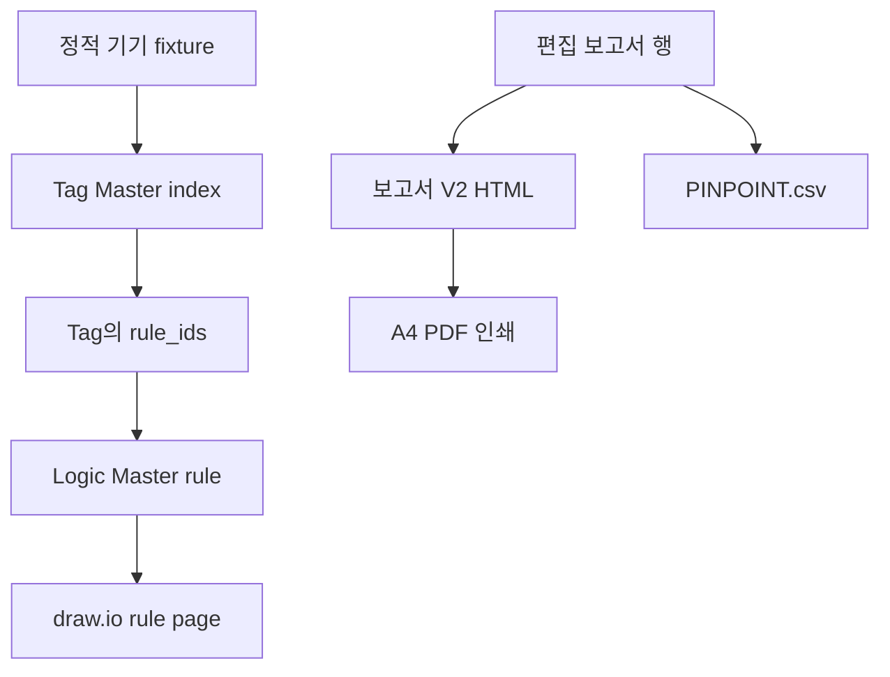

# TripLens 연동 단위기기 Testbench · 보고서 V2

## 목적과 경계

`/testbench`는 운영 분석 전에 웹 배포물 안의 정적 연결을 독립적으로 검사한다. Gemini, Agent API, 업로드 파일, 현장 설비 및 제어 계층을 호출하지 않는다. 따라서 PASS는 **Tag Master → Logic Master → draw.io 페이지와 보고서 내보내기 코드의 연결 무결성**만 뜻하며 사고 원인 확정이나 운전 승인이 아니다.

현재 구현 기준은 Vercel 웹 배포물이며, Windows Local V8 Runtime과 물리 실행의 검증을 대체하지 않는다.

## 검사 흐름



각 기기 행은 다음 네 조건이 모두 참일 때만 PASS다.

1. Source Tag가 `logic_diagram_index.json.tags`에 존재한다.
2. Source Tag의 `rule_ids`가 기대 Rule을 포함한다.
3. 기대 Rule이 `logic_diagram_index.json.rules`에 존재한다.
4. Rule의 `rule_page`가 `logic_diagram_index.json.pages`에 존재한다.

비슷한 이름의 태그나 Rule로 대체 매칭하지 않는다.

## 단위기기 fixture

| 설비 | Source Tag | 기대 Rule |
|---|---|---|
| GT | `vppGTTripLatch` | `PROT-GT-LATCH` |
| ST | `vppSTTripLatchPublished` | `PROT-ST-LATCH` |
| 52GT | `vpp52GTTripCmd` | `SEQ-52GT-TRIPCMD` |
| 52ST | `vpp52STTripCmd` | `SEQ-52ST-TRIPCMD` |
| HP FWP | `vppHPFWPTripLatchNative` | `CMD-FWP-HP-TRIP` |
| IP FWP | `vppIPFWPTripLatchNative` | `CMD-FWP-IP-TRIP` |
| LP FWP | `vppLPFWPTripLatchNative` | `CMD-FWP-LP-TRIP` |
| HP Drum | `vppHPDrumLLRaw` | `PROT-HP-DRUM-LL` |
| IP Drum | `vppIPDrumLLRaw` | `PROT-IP-DRUM-LL` |
| LP Drum | `vppLPDrumLLRaw` | `PROT-LP-DRUM-LL` |

화면의 `태그 도면`과 `Rule 도면` 버튼은 운영 분석 화면과 동일한 `LogicLibraryDialog`를 사용한다. 테스트용 별도 뷰어를 두지 않아 실제 연결과 검증 연결의 불일치를 막는다.

## 근거 상세과 로직 도면 매핑

근거 상세는 Evidence Catalog에 기록된 값만 사용한다.

| Evidence 필드 | 상세 화면 동작 |
|---|---|
| `source_node` → `canonical_tag` → `tag` | 첫 유효 값을 `태그 도면` 링크로 표시 |
| `logic_ids[]` | 각 등록 ID를 `Logic 도면` 링크로 표시 |
| 매핑 없음 | 임의 추론 없이 미등록/미확인으로 유지 |

등록된 Rule을 열 수 있다는 사실은 해당 Rule이 사고 원인이라는 뜻이 아니다. 이 경계 문구는 상세 화면과 도면 모달에 모두 유지한다.

## 보고서 V2

운영 화면의 편집 테이블 `reportRows`가 단일 내보내기 입력이다. PDF는 분석 객체에서 행을 다시 생성하지 않고 사용자가 보고 있는 8개 열(구분, 항목, 내용, 상태, 근거 ID, 관련 태그, 기록 시각, 비고)을 그대로 다음 10개 섹션에 배치한다.

1. 개요
2. 사고 발생 전 운전 현황
3. 장애 현상
4. 시간대별 사건·자동동작(SOE)
5. 발생 원인
6. 운전원·정비 조치사항
7. 조치 결과 및 복구 판정
8. 추정 원인 및 미확인 사항
9. 재발방지 대책 — 검토 권고사항
10. 증거자료

자동 EVENT는 4번 SOE에만 배치하고 사람이 실제로 입력한 확인·조작·정비 기록은 6번에 둔다. 이 구분과 단일 `reportRows` 입력으로 편집한 문구가 PDF와 초안 CSV에서 달라지는 경로를 차단한다.

### 근거 완전성 정책

운영 보고서의 Evidence Catalog는 전체 병합 EVENT와 실제 도구 조회로 반환된 Evidence Catalog의 합집합이다.

- 업로드 EVENT와 서버 보강 EVENT를 `evidence_id || event_id`로 병합하며 같은 ID에서는 Source 태그와 Logic 매핑을 가진 서버 보강값을 우선한다.
- 병합된 EVENT는 일부만 조회되었더라도 전부 `source_kind: EVENT`로 증거자료에 남긴다.
- 같은 EVENT가 조회 Catalog에도 있으면 조회된 상세 필드를 우선한다.
- RAW는 실제로 조회되어 반환된 표본만 포함한다. 업로드 RAW 전체를 AI가 읽거나 인용했다고 표시하지 않는다.
- 증거자료 밖의 보고서 행이 참조하는 비어 있지 않은 Evidence ID는 모두 증거자료에서 해소되어야 한다. 끊어진 참조가 있으면 누락 ID를 표시하고 PDF, PINPOINT 및 초안 CSV 내보내기를 모두 막는다.

### 복구 기록과 문서 상태

복구 입력은 보고서 일반 편집과 분리해 상태, 복구 시각, 수행자, 실제 조치, 재기동 조건, Evidence ID, 승인자를 기록한다. 저장 상태는 `UNKNOWN`, `PARTIAL`, `RECOVERED`, `NOT_RECOVERED`이며 화면과 내보내기는 다음 사람 중심 워크플로 라벨을 사용한다.

| 조건 | 화면 라벨 | 문서 영향 |
|---|---|---|
| 아직 사람 입력 없음 | `복구 기록 입력 대기` (`INPUT_PENDING`) | `초안` 유지 |
| 선택한 상태의 필수 입력 누락 | `복구 기록 입력 대기` (`INPUT_PENDING`) | `초안` 유지 |
| 필수 입력 완료, 승인 기록 미완료 | `복구 기록 완료 · 승인 대기` (`APPROVAL_PENDING`) | `초안` 유지 |
| 기록과 승인 완료 | `복구 기록 승인 완료` (`APPROVED`) | 원인 Verification Gate도 PASS일 때만 `검토 완료` |

공학적 상태 `UNKNOWN`과 사람의 `복구 기록 입력 대기`는 다른 의미다. 입력 근거 PASS, 원인 검증 PASS, 복구 기록 승인 완료도 서로 독립된 판단이며 어느 하나가 나머지를 대신하지 않는다.

### 레거시 `/testbench` 호환 경로

실제 운영 화면은 10개 섹션용 `reportAdapter.mjs`를 거치지만, 동결된 `/testbench`는 `integrationTestbench.mjs`의 기존 어댑터를 직접 호출한다. 입력에 운영 화면의 10개 섹션 행이 없으면 공유 렌더러는 기존 9개 섹션 fallback을 사용하고 `9. 증거자료`를 유지한다. 따라서 실제 앱의 10개 섹션 전환이 정적 단위기기 fixture나 판정 로직을 바꾸지 않는다.

- `보고서 V2 PDF`: A4 인쇄 전용 창을 열어 브라우저 PDF 저장 기능을 사용한다.
- `PINPOINT.csv`: 근거 및 인과 단계 검토용 고정 스키마를 내보낸다.
- `고장보고서 초안 CSV`: 현재 편집 테이블의 8개 열을 그대로 내보낸다.

PDF/PINPOINT 생성은 분석을 재실행하지 않고 EVENT/RAW 원본도 변경하지 않는다.

## 자동 검증

```bash
node --test tests/test_report_export.mjs tests/test_integration_testbench.mjs
npm ci --prefix apps/web --no-audit --no-fund
npm run build --prefix apps/web
python tests/browser_v8_review.py
```

브라우저 검증은 데스크톱 1440×1000과 모바일 390×844에서 다음을 확인한다.

- 근거 상세의 Source Tag 및 등록 Rule 버튼
- Rule 버튼이 여는 draw.io iframe 주소
- 현재 편집 행과 보고서 V2/PINPOINT/초안 CSV 버튼
- `/testbench`의 기기 10개 ALL PASS와 도면 모달
- 페이지 전역 가로 넘침 및 브라우저 page error 부재

## GitHub → Vercel 단일 main 승격

현재 Vercel Git 구성은 PR 브랜치 Preview를 만들지 않고 `main`만 배포한다. 따라서 사용할 수 없는 PR Preview 검증이나 Preview artifact promote를 절차에 포함하지 않는다.

1. 로컬 단위·백엔드·Next 빌드·브라우저 검증과 동결 파일 비교를 통과한다.
2. 기능 브랜치를 한 번 push해 PR을 열고 모든 필수 GitHub PR CI를 통과한다.
3. 검증된 PR head가 최신 `origin/main`을 포함하는지 확인한 뒤 `main`에 한 번만 merge한다.
4. 그 merge SHA에 대해 `Vercel – triplens-web-preview`와 `Vercel – triplens-agent-api-preview` 두 프로젝트 상태가 모두 성공했는지 확인한다.
5. 같은 SHA의 web `/`, `/logic`, `/testbench`와 agent API `/health`, `/contract`를 smoke 검증한다.

즉 실제 순서는 **PR CI → one main merge → two Vercel project statuses**다. CI 실패, 두 Vercel 상태 중 하나의 실패, 배포 SHA 불일치 중 하나라도 있으면 성공으로 판정하지 않는다. merge 후 실패는 `main`에 직접 추가 수정하지 않고 두 프로젝트를 이전 정상 배포로 rollback한 뒤 새 fix branch와 PR gate로 처리한다.
