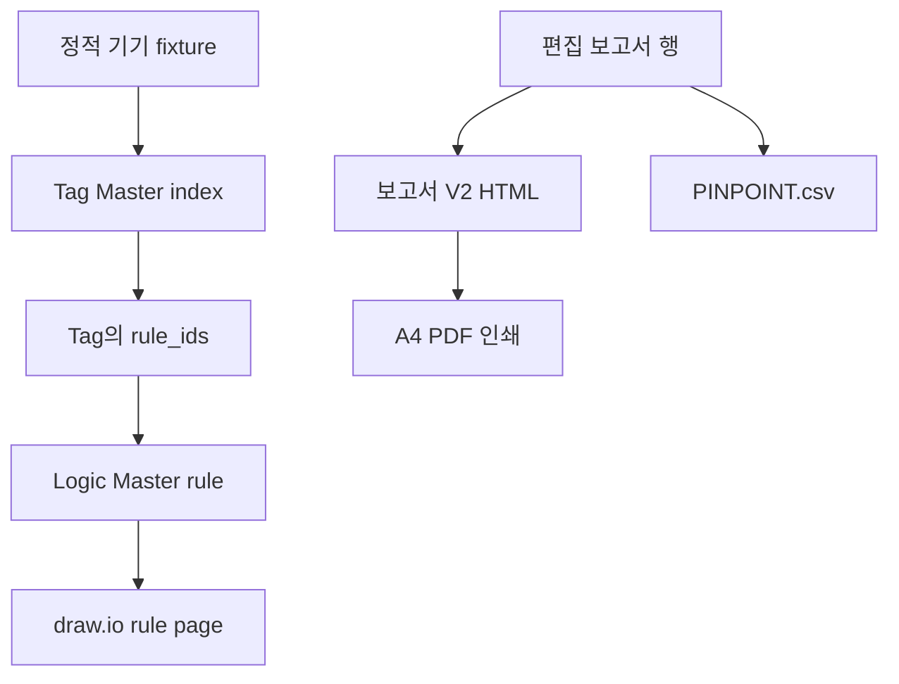

# TripLens 연동 단위기기 Testbench · 보고서 V2

## 목적과 경계

`/testbench`는 운영 분석 전에 웹 배포물 안의 정적 연결을 독립적으로 검사한다. Gemini, Agent API, 업로드 파일, 현장 설비 및 제어 계층을 호출하지 않는다. 따라서 PASS는 **Tag Master → Logic Master → draw.io 페이지와 보고서 내보내기 코드의 연결 무결성**만 뜻하며 사고 원인 확정이나 운전 승인이 아니다.

현재 구현 기준은 Vercel 웹 배포물이며, Windows Local V8 Runtime과 물리 실행의 검증을 대체하지 않는다.

## 검사 흐름



각 기기 행은 다음 네 조건이 모두 참일 때만 PASS다.

1. Source Tag가 `logic_diagram_index.json.tags`에 존재한다.
2. Source Tag의 `rule_ids`가 기대 Rule을 포함한다.
3. 기대 Rule이 `logic_diagram_index.json.rules`에 존재한다.
4. Rule의 `rule_page`가 `logic_diagram_index.json.pages`에 존재한다.

비슷한 이름의 태그나 Rule로 대체 매칭하지 않는다.

## 단위기기 fixture

| 설비 | Source Tag | 기대 Rule |
|---|---|---|
| GT | `vppGTTripLatch` | `PROT-GT-LATCH` |
| ST | `vppSTTripLatchPublished` | `PROT-ST-LATCH` |
| 52GT | `vpp52GTTripCmd` | `SEQ-52GT-TRIPCMD` |
| 52ST | `vpp52STTripCmd` | `SEQ-52ST-TRIPCMD` |
| HP FWP | `vppHPFWPTripLatchNative` | `CMD-FWP-HP-TRIP` |
| IP FWP | `vppIPFWPTripLatchNative` | `CMD-FWP-IP-TRIP` |
| LP FWP | `vppLPFWPTripLatchNative` | `CMD-FWP-LP-TRIP` |
| HP Drum | `vppHPDrumLLRaw` | `PROT-HP-DRUM-LL` |
| IP Drum | `vppIPDrumLLRaw` | `PROT-IP-DRUM-LL` |
| LP Drum | `vppLPDrumLLRaw` | `PROT-LP-DRUM-LL` |

화면의 `태그 도면`과 `Rule 도면` 버튼은 운영 분석 화면과 동일한 `LogicLibraryDialog`를 사용한다. 테스트용 별도 뷰어를 두지 않아 실제 연결과 검증 연결의 불일치를 막는다.

## 근거 상세과 로직 도면 매핑

근거 상세는 Evidence Catalog에 기록된 값만 사용한다.

| Evidence 필드 | 상세 화면 동작 |
|---|---|
| `source_node` → `canonical_tag` → `tag` | 첫 유효 값을 `태그 도면` 링크로 표시 |
| `logic_ids[]` | 각 등록 ID를 `Logic 도면` 링크로 표시 |
| 매핑 없음 | 임의 추론 없이 미등록/미확인으로 유지 |

등록된 Rule을 열 수 있다는 사실은 해당 Rule이 사고 원인이라는 뜻이 아니다. 이 경계 문구는 상세 화면과 도면 모달에 모두 유지한다.

## 보고서 V2

운영 화면의 편집 테이블 `reportRows`가 단일 내보내기 입력이다. PDF는 분석 객체에서 행을 다시 생성하지 않고 사용자가 보고 있는 8개 열(구분, 항목, 내용, 상태, 근거 ID, 관련 태그, 기록 시각, 비고)을 그대로 9개 고정 섹션에 배치한다. 그래서 편집한 문구가 PDF와 초안 CSV에서 달라지는 경로를 차단한다.

- `보고서 V2 PDF`: A4 인쇄 전용 창을 열어 브라우저 PDF 저장 기능을 사용한다.
- `PINPOINT.csv`: 근거 및 인과 단계 검토용 고정 스키마를 내보낸다.
- `고장보고서 초안 CSV`: 현재 편집 테이블의 8개 열을 그대로 내보낸다.

PDF/PINPOINT 생성은 분석을 재실행하지 않고 EVENT/RAW 원본도 변경하지 않는다.

## 자동 검증

```bash
node --test tests/test_report_export.mjs tests/test_integration_testbench.mjs
npm ci --prefix apps/web
npm run build --prefix apps/web
python tests/browser_v8_review.py
```

브라우저 검증은 데스크톱 1440×1000과 모바일 390×844에서 다음을 확인한다.

- 근거 상세의 Source Tag 및 등록 Rule 버튼
- Rule 버튼이 여는 draw.io iframe 주소
- 현재 편집 행과 보고서 V2/PINPOINT/초안 CSV 버튼
- `/testbench`의 기기 10개 ALL PASS와 도면 모달
- 페이지 전역 가로 넘침 및 브라우저 page error 부재

## GitHub → Vercel 1회 승격

운영 갱신 횟수를 아끼기 위해 다음 순서를 고정한다.

1. 로컬 단위·백엔드·Next 빌드·브라우저 검증을 통과한다.
2. 기능 브랜치를 GitHub에 push하고 PR CI의 필수 검사를 통과한다.
3. **CI가 통과한 동일 commit SHA**의 Vercel Preview만 검증한다.
4. Preview의 `/testbench`, `/`, `/logic`과 API `/contract`를 확인한다.
5. 새 빌드를 만들지 않고 검증한 Preview 배포 artifact를 Production으로 promote한다.
6. Production alias와 commit SHA가 일치하는지 확인한다.

CI 실패, Preview FAIL, SHA 불일치 중 하나라도 있으면 Production 승격을 중단한다. 운영을 여러 번 다시 배포해서 고치는 방식은 이 절차에 포함되지 않는다.
