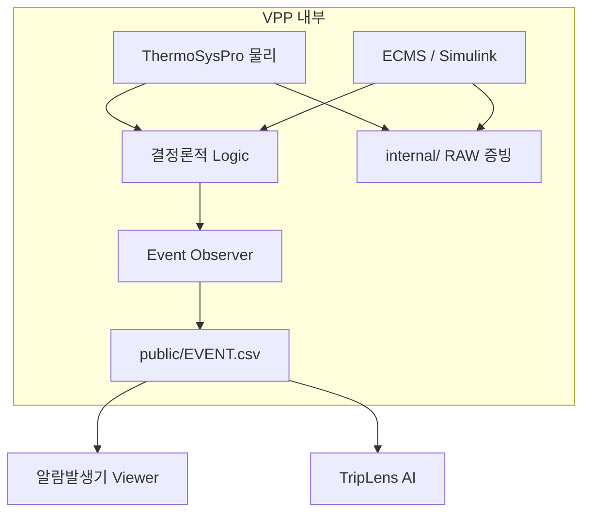

# TripLens 최종 VPP Event 아키텍처 V1

## 한 줄 계약

VPP는 내부에서 물리 RAW와 ECMS RAW를 사용해 결정론적 상태·알람을 계산하지만,
알람발생기와 TripLens AI에는 **단 하나의 `EVENT.csv`만 전달한다.**



알람발생기는 임계값 판정, 상태 추론, 중복 제거 또는 AI 호출을 하지 않는다.
`EVENT.csv`를 시간순으로 재생하는 Viewer다. TripLens AI도 같은 파일만 받고
RAW 시계열에는 접근하지 않는다.

## 저장소 책임

| 경계 | 책임 | 하지 않는 일 |
|---|---|---|
| R&D (`triplens-matlab-cosim-runner`) | Plant Model v2, ECMS/Simulink, 물리·제어 상태 검증 | Competition 저장소에 MATLAB 코드를 복제하지 않음 |
| Competition (`triplens-thermosyspro-cloud-runner`) | 검증된 내부 출력을 하나의 Event 계약으로 게시 | 원인 정답 생성, RAW의 AI 전달 |
| 알람발생기 | `EVENT.csv` 그대로 표시·필터 | RAW 해석, 알람 생성 |
| TripLens AI | Event 순서·관계 해석 | H/HH/L/LL 또는 차단기 상태를 RAW에서 재판정 |

PR #6의 synthetic motor/check-valve 물리는 이 아키텍처에 포함되지 않는다.
FWP-HP는 PR #7의 경계대로 R&D `fwpHpSpeedCmd`와 native
`PompeAlimHP`를 물리 진실원으로 사용한다.

## VPP Run 디렉터리

```text
vpp-run/
├── internal/
│   ├── evidence/
│   │   ├── THERMO_RAW.csv       # 있을 때만, 검증 전용
│   │   ├── ECMS_RAW.csv         # 있을 때만, 검증 전용
│   │   └── logic snapshot       # 해당 Run의 결정론적 설정
│   └── event-manifest.json      # 해시·행수·책임 경계
└── public/
    └── EVENT.csv                # 유일한 외부 입력
```

`public/`에 RAW나 manifest가 하나라도 추가되면 validation gate가 실패한다.
GitHub Actions도 public Event artifact와 internal evidence artifact를 별도로
업로드한다. 알람발생기와 AI 파이프라인은 public artifact만 선택한다.

## EVENT.csv 계약

계약 원본은 `config/event_contract_v1.json`이다. 주요 열은 다음과 같다.

| 열 | 의미 |
|---|---|
| `sequence` | 전체 Event 표시 순서 |
| `same_time_order` | 동일 시각 내 안정적인 표시 순서. 인과적 미세순서를 뜻하지 않음 |
| `event_time_s` / `event_time_ns` | VPP 기준시각. 재표본화 없이 정수 ns로 보존 |
| `source_time_s` | 원 상태가 계산된 시각 |
| `platform_time_s` | DCS/ECMS 자체 시계가 있을 때의 기록 시각 |
| `system` | `DCS1`, `DCS2`, `ECMS` |
| `source` | Event를 만든 모델 신호 또는 논리 상태 |
| `tag` | Tag Master 형식의 Event 태그 |
| `event_type` / `state` | Trip, Breaker, Alarm, State와 그 상태 |
| `old_value` / `new_value` | Event를 만든 단일 상태변화 값. 연속 RAW 시계열이 아님 |
| `logic_status` | 현장 승인 여부를 포함한 설정 상태 |
| `provenance` | Modelica/Simulink 상태 또는 결정론적 논리 출처 |

다음 열은 계약상 금지한다.

- `scenario`, `scenario_id`, `incident_id`
- `cause_id`, `root_cause`, `expected_root_cause`
- `diagnosis`, `answer`, `ground_truth`, `label`
- RAW 행·시계열 payload

대소문자·구분자·CamelCase가 달라도 금지 prefix를 정규화해 검사하므로
`ScenarioName`, `answer_key`, `raw_payload_json` 같은 우회 열도 게시 전에 거부한다.

따라서 AI는 사건 이름과 순서를 근거로 분석해야 하며 정답 열을 읽을 수 없다.

## 시각 처리

Event Observer는 RAW를 1 ms 격자로 다시 펴지 않는다. 같은 native timestamp에
여러 상태변화가 있으면 모두 같은 `event_time_ns`로 보존하고
`same_time_order`만 부여한다. 이 순번은 파일의 재현 가능한 표시순서일 뿐,
동일 시각 사건 사이의 물리적 인과를 주장하지 않는다.

따라서 Simulink RAW에 최초 차단기 OPEN이 `18.081 s`로 기록되면
`EVENT.csv`도 `18.081 s`를 기록한다. `18.080 s`로 보이게 하려고 1 tick을
당기지 않는다. 반대로 native duplicate row에서 `18.080 s` 상태변화가 직접
확인되면 그대로 `18.080 s`를 보존한다.

## 현재 직접 검증된 FWP-HP 경로

R&D GitHub Action run `34322671655`가 만든 0~30초, 1 ms, 30,001행 ECMS RAW를
Event Observer에 입력했다. 결과는 37개 상태변화다.

이 Action은 기존 exporter가 차단기 OPEN을 `18.080 s`로 고정 기대한 탓에 최종
검증 단계에서 실패했다. 하지만 `if: always()`로 보존된 실제 RAW artifact에는
최초 OPEN이 `18.081 s`로 기록돼 있다. 여기서는 실패를 PASS로 바꾸지 않고,
그 artifact의 관측값을 그대로 회귀 fixture와 Event 시각에 사용한다.

Trip 핵심 구간은 다음과 같다.

| VPP 시각 | Event |
|---:|---|
| 18.000 s | FWP-HP Trip Request, Run Enable 해제, Trip Latch, VCB Trip Cmd, Running 해제, Tripped 진입 |
| 18.002 s | Run Feedback 상실 |
| 18.081 s | `ECMS.VCB-A01.CLOSED` 1→0, Breaker Open |
| 18.100 s | Speed Proven 상실 |

현재 37개는 **ECMS 실제 시뮬레이션 Event**다. ThermoSysPro FWP 물리 E2E가
완료되면 같은 builder에 DCS1/DCS2의 Modelica 논리 Event를 `--source-event`로
추가한다. 출력 파일은 늘어나지 않고 동일한 `EVENT.csv`에 병합된다.

## 실행과 검증

```bash
python3 scripts/build_vpp_event_bundle.py \
  --bundle-dir outputs/vpp-final \
  --run-id RUN-001 \
  --ecms-raw path/to/ECMS_RAW.csv

python3 scripts/validate_vpp_event_bundle.py \
  --bundle-dir outputs/vpp-final

python3 scripts/read_event_feed.py \
  --event outputs/vpp-final/public/EVENT.csv \
  --consumer alarm-console

python3 scripts/read_event_feed.py \
  --event outputs/vpp-final/public/EVENT.csv \
  --consumer triplens-ai
```

표준화된 로직이 완성되면 프로그램을 바꾸지 않고
`config/ecms_event_map_v1.csv` 또는 DCS 논리 출력만 교체한다.
