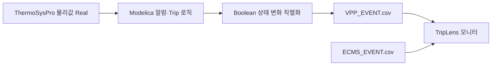

# VPP Modelica Event Engine — provisional draft

이 경로는 기존 RAW-only Action을 보존한 채, 시연용 VPP 알람·보호 로직을
ThermoSysPro/OpenModelica 실행 안에 넣는 별도 실행 경로다.

## 책임 경계



- Modelica가 절대 임계값, H/L 방향, 히스테리시스, pickup delay와 공통 Trip
  matrix를 계산한다.
- `export_vpp_events.py`는 Modelica Boolean의 `false↔true` 변화만 기록한다.
  실제값이 임계값을 넘었는지 다시 판정하지 않는다.
- TripLens 알람 화면은 `system=DCS1|DCS2`를 기준으로 표시·필터링만 한다.
- ECMS 사건은 별도 `ECMS_EVENT.csv`로 유지하고 화면에서 시간순으로 병합한다.
- 원인·정답·시나리오 라벨은 RAW와 Event CSV에 넣지 않는다.

## 현재 초안 범위

| 구분 | 현재 수량 | 경로 |
|---|---:|---|
| Modelica 알람 판정 | 31 | DCS1 7 + DCS2 24 |
| Trip/Relay/52G 상태 사건 | 8 | DCS1 |
| 전체 Event 규칙 | 39 | `config/vpp_event_logic_provisional.csv` |

DCS1은 GT/ST, DCS2는 HRSG 계통으로 라우팅한다. 현재 규칙에는 승인된 BOP
알람 정정치가 없으므로 BOP 값을 새로 꾸며 넣지 않았다. BOP와 통신 사건은
승인된 표준 규칙 또는 ECMS 사건이 들어오면 같은 스키마로 추가한다.

모든 현재 설정은 `PROVISIONAL_NOT_PLANT_APPROVED`다. 기존
`config/dcs_alarm_rules.csv`의 31개 값을 그대로 이식했으며 발전소 정정치로
간주하면 안 된다.

## 산출물

| 파일 | 역할 |
|---|---|
| `VPP_RAW.csv` | OpenModelica 결과의 바이트 그대로인 물리값·모델 상태 |
| `VPP_EVENT.csv` | DCS1/DCS2 통합 시간순 사건 |
| `DCS1_EVENT.csv` | 통합 사건의 DCS1 정확한 부분집합 |
| `DCS2_EVENT.csv` | 통합 사건의 DCS2 정확한 부분집합 |
| `VPP_LOGIC_SNAPSHOT.csv` | 해당 Run에 실제 사용한 규칙 스냅샷 |
| `vpp-event-manifest.json` | 파일 해시·행 수·책임 경계 |

`VPP_EVENT.csv`에는 실제 발생 시각, 실제 물리값, pickup/return 설정값,
Modelica 상태 변수, 규칙 버전과 상태가 함께 기록된다. 색상은 모니터가 다시
추론하지 않도록 강한 고정 색으로 전달한다.

- Trip: `#D71920`
- HH/LL: `#F97316`
- H/L: `#FACC15`
- 조작: `#0067C5`
- 통신: `#7C3AED`
- 일반 상태: `#64748B`

## 표준 로직으로 교체

표준화가 끝나면 코드를 고치는 대신 동일 스키마의 CSV를 `--rules`에 넘긴다.

```bash
python3 scripts/generate_vpp_modelica_logic.py \
  --rules config/vpp_event_logic_standardized.csv
```

기존 물리 신호를 사용하는 임계값 변경·규칙 추가는 자동으로 Modelica 코드가
재생성된다. 새 물리 신호를 추가할 때만
`config/vpp_modelica_signal_bindings.csv`에 ThermoSysPro 식을 한 줄 추가한다.

## 실행

GitHub Actions의 `Generate VPP RAW and Modelica-owned events`에서 FWP-HP,
FWP-IP 또는 FWP-LP를 선택한다. 로컬 Docker 실행은 다음과 같다.

```bash
scripts/run_vpp_event_pipeline.sh FWP-HP 300 420 4200
```

## 현재 물리 결합 한계

선택한 FWP 차단기 개방은 모터 토크·회전관성·펌프·체크밸브를 거쳐 실제
ThermoSysPro 물리값을 변화시킨다. 그 물리값으로부터 드럼 보호와 GT/ST
Trip/Relay/52G 상태가 Modelica 안에서 계산된다.

다만 공통 Trip 뒤 GT 배기가스 경계와 ST 증기밸브까지 동시에 다시 연결하는
열역학 폐루프는 현재 대형 모델 초기화가 검증되지 않아 이 초안에서는 활성화하지
않는다. 따라서 이 버전은 `물리 FWP → 공정값 → 보호판정 → 전기 Trip 상태 →
Event` 경로의 시연·통합본이며, 전체 발전소 보호설계나 현장 로직의 검증본이 아니다.
