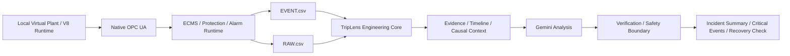

# TripLens — KIEE 2026 Agentic AI 제출 패키지 초안

> 상태: **RC0 DRAFT / 제출 전 검증용**
>
> 현재 구현 기준: **Windows Local V8 Runtime + 실제 Gemini 분석 + EVENT.csv / RAW.csv Dual Log**
>
> 이 문서의 수치는 실제 로컬 실행 근거가 있는 경우에만 기재한다. Blind Validation 성능값은 실제 시험 전까지 `NOT TESTED`로 유지한다.

## 1. 한 문장 정의

**TripLens는 발전소 사고 직후 생성되는 EVENT와 RAW 시계열을 결합해 핵심 사건, 인과 흐름, 근거 Tag, 영향 설비, 복구 확인사항을 도출하는 READ-ONLY Agentic AI 사고분석 시스템이다.**

## 2. 해결하려는 문제

발전소 사고 시 GT/ST, HRSG/BOP, 전기계통 등 여러 설비에서 Alarm·Protection Event·상태변화가 동시에 발생한다. 운전원은 여러 화면과 기록을 오가며 최초 사건, 직접 계기, 후속 파급, 현재 복구상태를 빠르게 구분해야 한다.

TripLens는 이 초기 정보정리 과정을 다음 입력으로 지원한다.

- `EVENT.csv`: Alarm, Protection Event, Breaker/설비 상태변화, Operator Action 등
- `RAW.csv`: 시각별 수치형 Historian/Process 값, Command/Logic/State evidence

## 3. 현재 V8 실행 구조

## 4. 현재 로컬 V8에서 확인된 기능

최신 로컬 V8.5.2 검증 패키지 기준:

- 66개 changeable Real input 계약
- GT/ST 독립 latch
- 9-cause GT/ST protection matrix
- HP/IP BFP 논리 chain 및 reset/reclose 경로
- 67-rule live alarm binding
- `EVENT.csv + RAW.csv` End-to-End Dual Log 검증
- Alarm/Protection 사건은 EVENT에 유지
- 내부 command/latch 파생 정보는 RAW evidence로 분리
- Live Historian 기반 RAW 데이터 확인
- Gemini 사고분석 UI 및 분석 결과 생성

## 5. Agentic AI의 역할

TripLens의 Gemini 분석 계층은 입력 데이터를 임의로 수정하는 제어기가 아니다.

AI 역할:
- 사건 흐름 요약
- 주요 Evidence 탐색 및 연결
- 원인 / 직접 계기 / 파급과정 구분
- 불확실성 및 추가 확인사항 정리
- Incident Brief 생성

Deterministic/Engineering 영역:
- 입력 검증
- 시간 정렬
- Tag/Logic 연결
- EVENT/RAW 근거 추출
- 상태/품질 검증
- Fail-Closed 경계

## 6. 안전 경계

- READ-ONLY 분석 계층
- OT Write 없음
- 자동 복전/복구 명령 없음
- Ground Truth는 분석 입력에 제공하지 않음
- 근거 부족 시 `UNKNOWN / INCONCLUSIVE / REVIEW REQUIRED` 허용
- 실제 운전·정비는 사업장 승인 절차와 승인 도면/Logic을 따름

## 7. 현재 검증 상태

| 항목 | 상태 |
|---|---|
| Local V8 Runtime | PASS evidence 있음 |
| EVENT + RAW Dual Log | PASS evidence 있음 |
| Plant-wide Alarm Binding | PASS evidence 있음 |
| Gemini Analysis | 실제 실행 확인 |
| Blind Multi-Incident Generalization | NOT TESTED |
| Critical Event Precision / Recall / F1 | NOT TESTED |
| Causal Chain Accuracy | NOT TESTED |
| Evidence Grounding Rate | NOT TESTED |
| Unsupported Claims | NOT TESTED |
| Fail-Closed Score | NOT TESTED |
| Time-to-Insight | NOT TESTED |

## 8. 제출 패키지 구성

- `01_SYSTEM_ARCHITECTURE.md` — 시스템 구성도 원본
- `02_TECHNICAL_DOCUMENT.md` — 기술문서 원본
- `03_WORKFLOW_DEFINITION.json` — Machine-readable Workflow
- `04_AI_USAGE_AND_LIMITATIONS.md` — AI 활용 및 한계
- `05_VALIDATION_REPORT.md` — Blind Validation 보고서 원본
- `06_VALIDATION_RESULTS.csv` — 시험성적표 데이터
- `07_PRESENTATION_OUTLINE.md` — 10분 발표 구조
- `08_DEMO_GUIDE.md` — 현장시연 / Replay 가이드

## 9. 제출 전 반드시 바꿔야 하는 것

1. V8 RC1 버전명 확정
2. Gemini 실제 모델명/호출방식 확정
3. GT / Feeder / Third Case Blind Run 실행
4. Scorecard 실측값 입력
5. 대표 Demo Case 확정
6. System Architecture / Technical Document PDF화
7. Presentation PPT/PDF 생성
8. Clean-folder 실행 및 ZIP 최종 검증

---

**현재 목표:** 기능 추가보다 `RC Freeze → Blind Run → Scorecard → 문서/발표 → 제출` 순서로 마무리한다.
