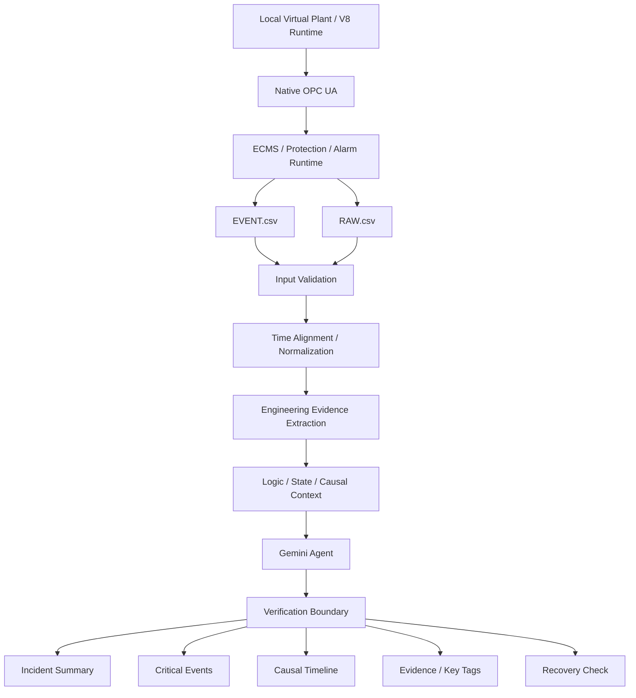
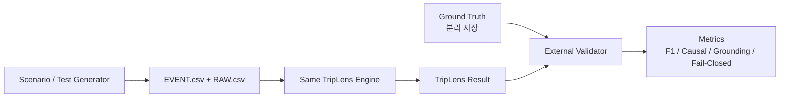

# TripLens System Architecture
## KIEE 2026 Agentic AI — RC0 Draft

## 1. 전체 구조

## 2. 계층별 책임

| 계층 | 역할 | AI 여부 |
|---|---|---|
| Local V8 Runtime | 합성 사고 및 설비/보호/공정 상태 생성 | 비AI |
| Native OPC UA | 물리/상태/명령 계약 전달 | 비AI |
| ECMS / Alarm Runtime | Protection, Breaker, Alarm/Event 생성 | 비AI |
| EVENT / RAW | 분석용 증거 데이터 | 비AI |
| Engineering Core | 검증, 정렬, Tag/Logic/Evidence 처리 | 비AI |
| Gemini Agent | Evidence 기반 사고 해석 및 설명 | AI |
| Verification Boundary | 과도한 확정판정 방지 | 비AI/Rule |
| Result UI | Timeline, Cause, Evidence, Recovery 표시 | 출력 |

## 3. EVENT / RAW 역할 분리

### EVENT.csv
사람이 사고 흐름을 이해할 때 의미 있는 사건을 기록한다.

- Alarm
- Protection Event
- Breaker Open / State transition
- Motor de-energized / Running lost
- Operator Action
- Return / Recovery Event

### RAW.csv
사건 판단의 수치적/상태적 근거를 보존한다.

- Process value
- Historian signal
- Command evidence
- Latch / logic state
- Breaker command
- Internal state
- Quality / timestamp

V8.5.2의 정책은 **정상 Alarm/Protection 사건은 EVENT에 유지하고 내부 command-tag leakage는 차단**하는 것이다.

## 4. 현재 V8 Runtime 검증 범위

최신 로컬 V8.5.2 검증 계약에 포함된 항목:

- 66 unique writable Real input declarations
- 9 protection causes
- independent GT/ST latches
- HP/IP BFP logical protection chain
- 67-rule live alarm binding
- EVENT.csv + RAW.csv E2E Dual Log
- fresh untripped final server start
- rollback-safe installer behavior

## 5. 중요한 물리모델 한계

현재 V8.5는 HP/IP BFP Trip 이후 **보호 논리 chain과 전기적 상태변화**는 검증하지만, HP/IP 전동기-펌프 축의 실제 coastdown 물리를 완전 구현했다고 주장하지 않는다.

> V8.5는 Protection Logic과 Event/RAW 생성 경로를 안정적으로 검증하며, HP/IP 축 coastdown의 고정밀 물리는 별도 plant-model validation 범위로 둔다.

## 6. Blind Validation Architecture

Blind 원칙:
- Scenario ID를 TripLens에 전달하지 않음
- Expected Cause를 전달하지 않음
- Ground Truth를 전달하지 않음
- 사고별 분석엔진 코드 수정 금지
- 결과 생성 후에만 외부 Validator가 Ground Truth와 비교

## 7. 현장 적용 경계

TripLens는 보호·제어·복전 명령을 수행하지 않는다.

**Authority: NONE / READ ONLY**
